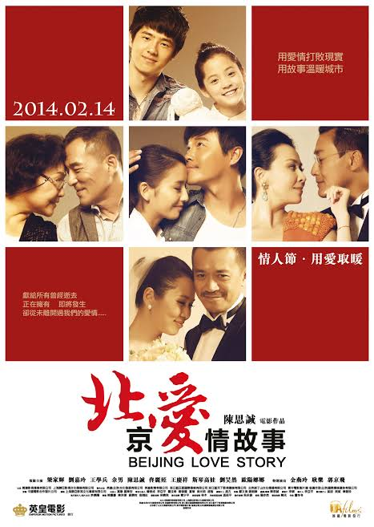

Beijing Love Story is a 2014 Chinese romance film written and directed by Chen Sicheng adapted from the 2012 Chinese TV series of the same name which was also written and directed by Chen.

# Synopsis

The movie tells the stories of five pairs of lovers, each from a different period of their lives. All five couples, though different in age and circumstance, are somehow linked to one another. Their stories all demonstrate the imperfection of love. Designer Chen Feng (Chen) falls in love with Shen Yan (Tong Liya) at a friend's bachelor party, but finds that he might be too poor to sustain a relationship with her. Chen's boss (Wang Xuebing) cheats with alarming regularity on his dutiful wife (Yu Nan). Vengeful wife tries to cheat with her own employer (Leung), who in turns jets off to Greece for a decadent rendezvous with his mistress (Lau). A young man (Liu Haoran) pines after his cello-playing classmate (Ouyang Nana). His grandfather (Wang Qingxiang) goes on a series of blind dates set up by choir teacher Mrs Gao (Siqin Gaowa).