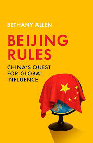

O livro Beijing Rules: China's Quest for Global Influence examina como o governo chinês usa sua economia para exercer poder e influência no mundo. A obra foi escrita pela jornalista Bethany Allen e lançada em agosto de 2023.