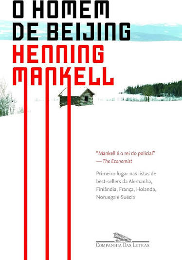

A juíza distrital Birgitta Roslin vive e trabalha em Helsinborg, sul da Suécia, região próxima aos cenários enevoados em que Shakespeare ambienta a tragédia de Hamlet. Embora cansada, devido ao excesso de casos em julgamento, e exasperada com a infindável crise no casamento com Staffan, um calado condutor de trens, não pode reclamar da vida confortável de que ela e sua família desfrutam, após um começo difícil. Filha de uma mulher muito humilde e quase sem instrução, Birgitta teve de batalhar muito na vida, o que lhe incutiu grande consciência social - para lutar pela abolição das injustiças do mundo, a futura juíza, quando estudante, chegara a se envolver nos movimentos radicais de esquerda que se inspiravam na Revolução Cultural de Mao Tsé-Tung, lembrança da juventude ingênua que ainda se conserva em sua admiração pela grande história cultural da civilização chinesa. Mas o atual cotidiano pacato e previsível da juíza Roslin será chacoalhado pela notícia de um massacre de idosos, perpetrado num vilarejo do norte do país. Lendo por acaso os sobrenomes das vítimas nos jornais, Birgitta suspeita que o crime esteja relacionado ao passado de pessoas próximas, o que a leva a investigar os fatos por conta própria e à margem da lei - após o fracasso da polícia e da promotoria em decifrar esse enigma horripilante e complexo. A heroína do novo romance de Henning Mankell possui uma inteligência analítica certamente comparável à do inspetor Kurt Wallander. No entanto, a inexperiência em casos criminais de grande envergadura logo coloca sua vida em grande perigo. Ligando o assassinato das dezenove vítimas inocentes ao rastro de fome, tortura e morte deixado pelo imperialismo ocidental no século XIX, a trama de O homem de Beijing estabelece conexões inauditas com a política internacional da atualidade. Distribuída entre quatro continentes, a narrativa desafia as convenções do gênero policial, conduzindo a um vertiginoso labirinto de referências históricas, culturais e geopolíticas. “Henning Mankell é o rei do policial.” - The Economist