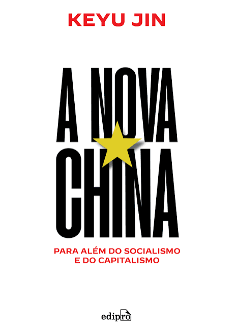

# A Nova China - Para Além do Capitalismo e do Socialismo 

A nova China é um guia imprescindível para a compreensão da economia chinesa e de sua ascensão. A despeito da visão ocidental e das reiteradas previsões de um colapso iminente, a China desenvolveu um modelo próprio alinhado a seus objetivos, suas condições e sua cultura. Uma abordagem que desafia conceitos convencionais e vem demonstrando resultados há décadas.

Com um pé em cada parte do mundo ― nascida na China, formada nos Estados Unidos e lecionando na Inglaterra ―, a renomada economista Keyu Jin desvenda, aqui, o enigma chinês. Do seu mercado consumidor ao desenvolvimento de grandes empresas, da atuação do Estado à inserção na economia global, Jin descreve os passos que levaram seu país à formação de um novo paradigma econômico mundial.

A nova China mostra que é possível conciliar o que pode parecer contraditório aos olhos ocidentais. É um relato esclarecedor sobre uma potência mundial em crescimento, sobre seu passado e seu potencial futuro. Um guia essencial para viajantes, agentes de negócios e todos os que almejam ter uma visão atualizada a respeito de uma das maiores potências mundiais.