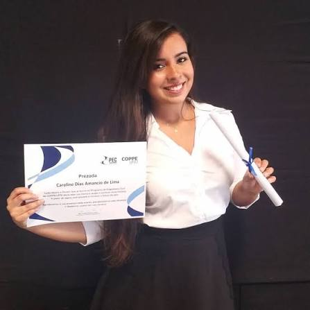

Atualmente é Professora Adjunta na Universidade Federal da Bahia (UFBA) no Departamento de Engenharia de Transportes e Geodésia (DETG) da Escola Politécnica e professora vinculada (colaboradora) ao Programa de Pós Graduação em Engenharia Civil (PPEC) da UFBA. É pesquisadora integrante da linha de pesquisa Infraestruturas de Transporte e Meio Ambiente do CETRAMA (Centro de Estudos de Transportes e Meio Ambiente) na UFBA. Vice-coordenadora do Colegiado do Curso de Engenharia Civil da UFBA. Professora e Vice-coordenadora do Curso de Especialização em Pavimentação da UFBA (lato sensu). Tem o cargo de Diretora Técnico-Científico da Fundação Escola Politécnica da Bahia (FEP). 

Formação acadêmica/profissional (Onde obteve os títulos, atuação profissional, etc.)
    Doutorado e Mestrado em Engenharia Civil pelo PEC/COPPE/UFRJ, área de concentração em Geotecnia com linha de pesquisa em Pavimentos e Estabilização de Solos. Possui graduação em Engenharia Civil pela Universidade Federal da Paraíba (UFPB) - Campus I. 

Áreas de Interesse (áreas de interesse de ensino e pesquisa)
    Atua na área de Geotecnia e Transportes com ênfase em Pavimentos e Infraestrutura de Transportes, principalmente nos seguintes temas: materiais de pavimentação, dimensionamento de pavimentos, avaliação estrutural e funcional de pavimentos, e mecânica dos pavimentos. Interesse em projetos, construção e gerência/manutenção de rodovias, ferrovias e aeroportos. 

