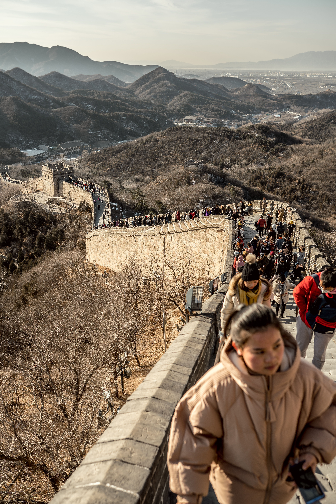

Para quem está visitando Beijing pela primeira vez e dispõe de apenas um dia livre, o ideal é focar no eixo histórico central da cidade. Esse percurso permite conhecer os monumentos imperiais mais marcantes com logística direta, sem perder horas em deslocamentos longos.

# Manhã: O Coração Imperial da China

## Praça da Paz Celestial
Nota: 4,44

📍 Praça

Praça da Paz Celestial (Tiananmen): Comece o dia cedo atravessando uma das maiores praças públicas do mundo. É o ponto de partida natural para entrar no palácio imperial.

::: {.callout-tips}
**Dica logística:**  A praça exige agendamento prévio com verificação de passaporte e controle de raio-X rigoroso na entrada.
:::

## Cidade Proibida
Nota: 4,64

📍 Atração turística
Fechado
· Horário de abertura: 8:30 AM sex.

Cidade Proibida (Museu do Palácio): Entre pelo Portão do Meio-Dia (Meridian Gate) e atravesse a residência oficial dos imperadores das dinastias Ming e Qing. Caminhe ao longo do eixo central contemplando os grandes salões cerimoniais e os pátios de mármore.

Atenção crucial: Os ingressos esgotam com até 7 dias de antecedência no site oficial/WeChat; faça a reserva para todo o grupo assim que abrirem as datas.

Início da Tarde: Vista Panorâmica e Almoço

:::{callout-tips}
**Passaporte físico:** Sempre carreguem o passaporte original na mochila. Todos os pontos turísticos em Beijing realizam checagem de identidade e leitura eletrônica do documento na catraca de entrada.
:::

## Jingshan
Nota: 4,64

🌳 Parque

Jingshan (Parque Jingshan): Saindo pelo portão norte da Cidade Proibida, atravesse a rua e suba a colina artificial até o Pavilhão Wanchun.

Do topo, o grupo terá a vista clássica e panorâmica de 360° dos telhados dourados da Cidade Proibida e do eixo urbano de Beijing.

Almoço tradicional: Aproveite os arredores para provar o autêntico Pato Laqueado de Pequim (Peking Duck), servido em fatias finas com panquecas no vapor e molho fermentado doce.

Meio da Tarde: Espiritualidade e Geometria Sacra

:::{.callout-atention}
**Calçados confortáveis:** O trajeto entre Tiananmen, Cidade Proibida e Jingshan é totalmente percorrido a pé e soma facilmente mais de 10 a 12 km de caminhada.
:::

## Templo do Céu
Nota: 4,64

🛐 Templo
Fechado
· Horário de abertura: 6:00 AM sex.

Templo do Céu (Tiantan): Siga de táxi/Didi ou pela Linha 5/8 do metrô em direção ao sul para visitar o complexo onde os imperadores realizavam rituais de sacrifício para pedir boas colheitas.

Visite o icônico Salão de Oração pelas Boas Colheitas, com sua cúpula redonda de três níveis erguida sem nenhum prego, e o Altar Circular, famoso por suas propriedades acústicas e design alinhado à cosmologia chinesa.

Fim de Tarde e Noite: Vida Noturna nos Hutongs

# Shichahai

Shichahai e os Hutongs Históricos: Termine o dia caminhando ao redor dos lagos de Shichahai e nas ruelas preservadas (hutongs) próximas à Torre do Tambor.

O local combina cafés, casas de chá, restaurantes com mesinhas à beira da água e apresentações de música ao vivo, proporcionando um ótimo contraste entre a Beijing ancestral e a vida contemporânea.

